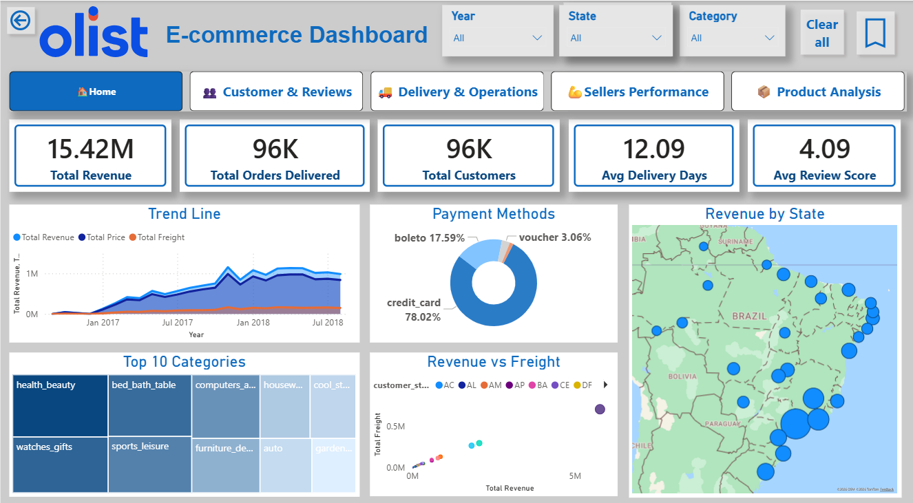
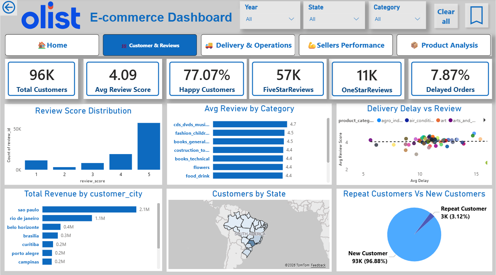
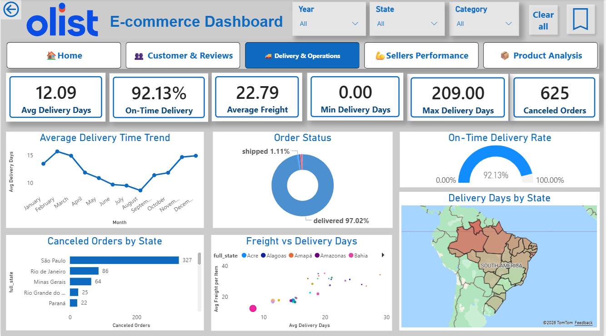
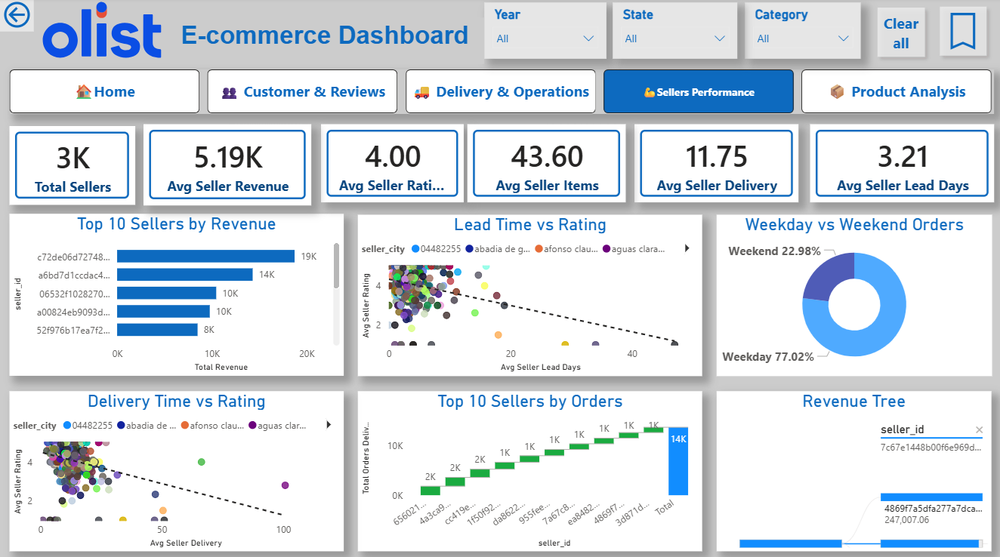
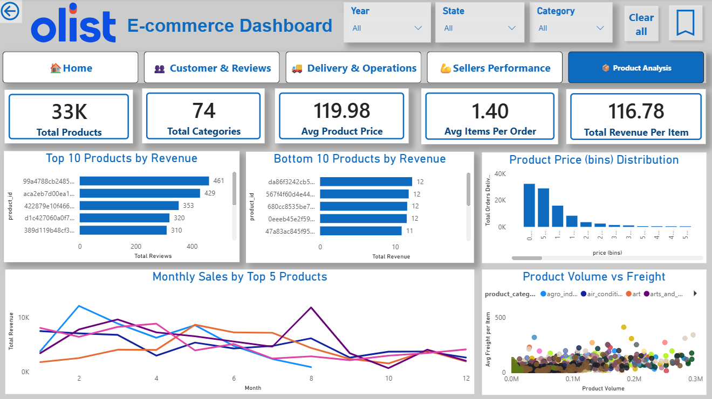

# Olist Power BI Dashboard

## Overview
Interactive dashboard with 5 pages analyzing Olist e-commerce data.

## Pages

### Page 1: Executive Dashboard

### Page 2: Customer & Reviews

### Page 3: Delivery & Operations

### Page 4: Sellers Performance

### Page 5: Products Analysis

## How to Use
1. Download `final_olist.pbix`
2. Open with Power BI Desktop (free)
3. Connect to SQL Server or CSV files
4. Refresh data

## Live Dashboard (Optional)
[View on Power BI Service](https://app.powerbi.com/links/uzWQ2Sv95w?ctid=2082de46-1afa-4b64-a440-6558f80e9840&pbi_source=linkShare)
