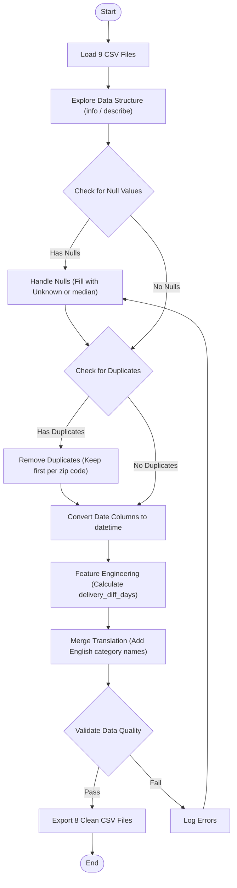
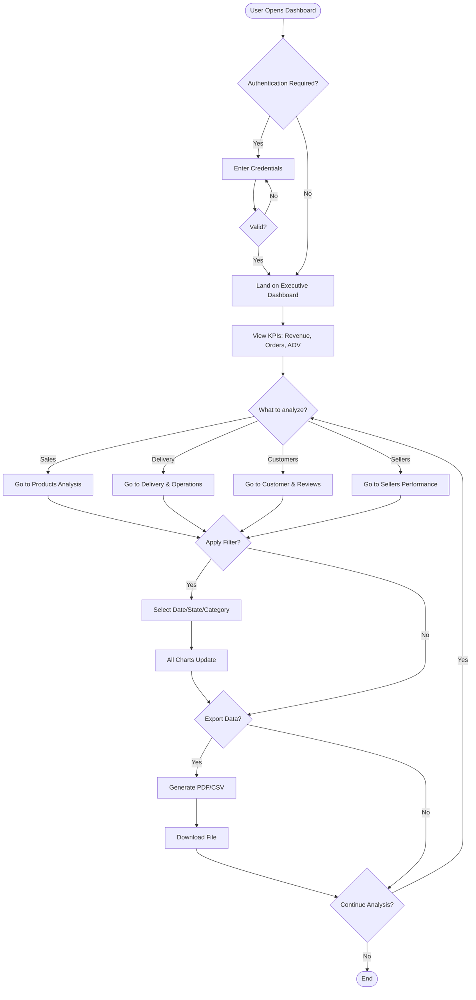
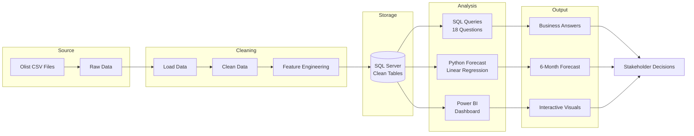

# Activity Diagrams

## 1. Data Cleaning Activity Diagram

```mermaid
flowchart TD
    Start([Start]) --> Load["Load 9 CSV Files"]
    Load --> Explore["Explore Data Structure (info / describe)"]
    Explore --> CheckNull{"Check for Null Values"}

    CheckNull -->|Has Nulls| HandleNull["Handle Nulls (Fill with Unknown or median)"]
    HandleNull --> CheckDuplicate
    
    CheckNull -->|No Nulls| CheckDuplicate{"Check for Duplicates"}
    
    CheckDuplicate -->|Has Duplicates| RemoveDuplicate["Remove Duplicates (Keep first per zip code)"]
    RemoveDuplicate --> ConvertDate
    
    CheckDuplicate -->|No Duplicates| ConvertDate["Convert Date Columns to datetime"]
    
    ConvertDate --> EngineerFeature["Feature Engineering (Calculate delivery_diff_days)"]
    EngineerFeature --> MergeTrans["Merge Translation (Add English category names)"]
    MergeTrans --> Validate{"Validate Data Quality"}
    
    Validate -->|Pass| Export["Export 8 Clean CSV Files"]
    Validate -->|Fail| LogError["Log Errors"]
    LogError --> HandleNull
    
    Export --> End([End])
```

## 2. User Dashboard Navigation Activity Diagram

```mermaid
flowchart TD
    Start([User Opens Dashboard]) --> Login{Authentication Required?}
    
    Login -->|Yes| Authenticate[Enter Credentials]
    Authenticate --> Valid{Valid?}
    Valid -->|No| Authenticate
    Valid -->|Yes| Landing[Land on Executive Dashboard]
    
    Login -->|No| Landing
    
    Landing --> ViewKPIs[View KPIs: Revenue, Orders, AOV]
    ViewKPIs --> Decision{What to analyze?}
    
    Decision -->|Sales| Products[Go to Products Analysis]
    Decision -->|Delivery| Delivery[Go to Delivery & Operations]
    Decision -->|Customers| Customers[Go to Customer & Reviews]
    Decision -->|Sellers| Sellers[Go to Sellers Performance]
    
    Products --> ApplyFilter{Apply Filter?}
    Delivery --> ApplyFilter
    Customers --> ApplyFilter
    Sellers --> ApplyFilter
    
    ApplyFilter -->|Yes| SelectFilter[Select Date/State/Category]
    SelectFilter --> UpdateCharts[All Charts Update]
    UpdateCharts --> Export{Export Data?}
    
    ApplyFilter -->|No| Export
    
    Export -->|Yes| GenerateReport[Generate PDF/CSV]
    GenerateReport --> Download[Download File]
    Download --> Continue{Continue Analysis?}
    
    Export -->|No| Continue
    
    Continue -->|Yes| Decision
    Continue -->|No| End([End])
```

## 3. Order to Insight Data Flow Activity Diagram

```mermaid
flowchart LR
    subgraph Source
        A[Olist CSV Files] --> B[Raw Data]
    end
    
    subgraph Cleaning
        B --> C[Load Data]
        C --> D[Clean Data]
        D --> E[Feature Engineering]
    end
    
    subgraph Storage
        E --> F[(SQL Server\nClean Tables)]
    end
    
    subgraph Analysis
        F --> G[SQL Queries\n18 Questions]
        F --> H[Python Forecast\nLinear Regression]
        F --> I[Power BI\nDashboard]
    end
    
    subgraph Output
        G --> J[Business Answers]
        H --> K[6-Month Forecast]
        I --> L[Interactive Visuals]
    end
    
    J --> M[Stakeholder Decisions]
    K --> M
    L --> M
```
