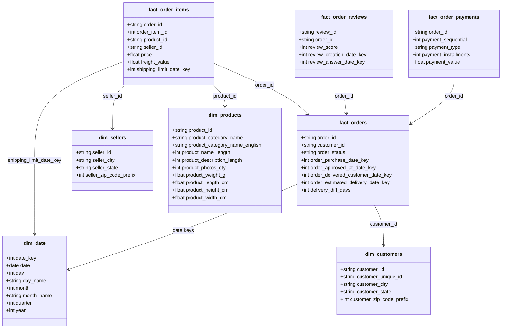
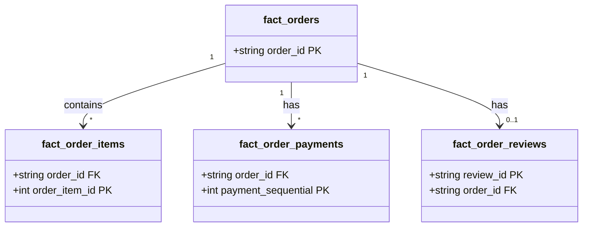

# Class Diagram (Galaxy Schema)

## Simplified Class Diagram for Olist Galaxy Schema

```mermaid
classDiagram
    class dim_customers {
        +string customer_id
        +string customer_unique_id
        +string customer_city
        +string customer_state
        +int customer_zip_code_prefix
    }

    class dim_products {
        +string product_id
        +string product_category_name
        +string product_category_name_english
        +int product_name_length
        +int product_description_length
        +int product_photos_qty
        +float product_weight_g
        +float product_length_cm
        +float product_height_cm
        +float product_width_cm
    }

    class dim_sellers {
        +string seller_id
        +string seller_city
        +string seller_state
        +int seller_zip_code_prefix
    }

    class dim_date {
        +int date_key
        +date date
        +int day
        +string day_name
        +int month
        +string month_name
        +int quarter
        +int year
    }

    class fact_orders {
        +string order_id
        +string customer_id
        +string order_status
        +int order_purchase_date_key
        +int order_approved_at_date_key
        +int order_delivered_customer_date_key
        +int order_estimated_delivery_date_key
        +int delivery_diff_days
    }

    class fact_order_items {
        +string order_id
        +int order_item_id
        +string product_id
        +string seller_id
        +float price
        +float freight_value
        +int shipping_limit_date_key
    }

    class fact_order_payments {
        +string order_id
        +int payment_sequential
        +string payment_type
        +int payment_installments
        +float payment_value
    }

    class fact_order_reviews {
        +string review_id
        +string order_id
        +int review_score
        +int review_creation_date_key
        +int review_answer_date_key
    }

    %% Relationships
    fact_orders --> dim_customers : customer_id
    fact_orders --> dim_date : date keys
    
    fact_order_items --> fact_orders : order_id
    fact_order_items --> dim_products : product_id
    fact_order_items --> dim_sellers : seller_id
    fact_order_items --> dim_date : shipping_limit_date_key
    
    fact_order_payments --> fact_orders : order_id
    
    fact_order_reviews --> fact_orders : order_id
```

## Class Relationships with Cardinalities

```mermaid
classDiagram
    class fact_orders {
        +string order_id PK
    }
    
    class fact_order_items {
        +string order_id FK
        +int order_item_id PK
    }
    
    class fact_order_payments {
        +string order_id FK
        +int payment_sequential PK
    }
    
    class fact_order_reviews {
        +string review_id PK
        +string order_id FK
    }
    
    fact_orders "1" --> "*" fact_order_items : contains
    fact_orders "1" --> "*" fact_order_payments : has
    fact_orders "1" --> "0..1" fact_order_reviews : has
```
