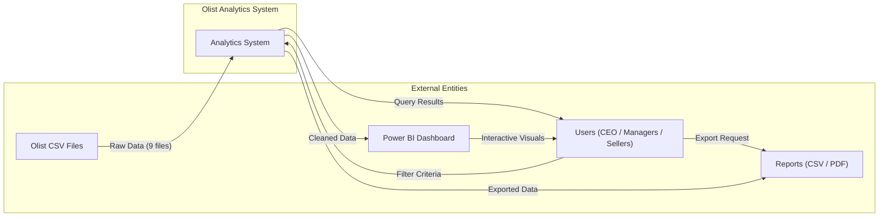
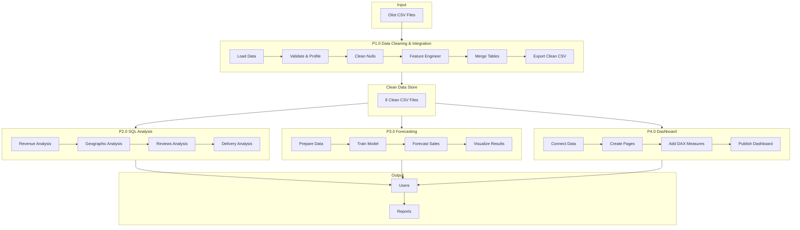
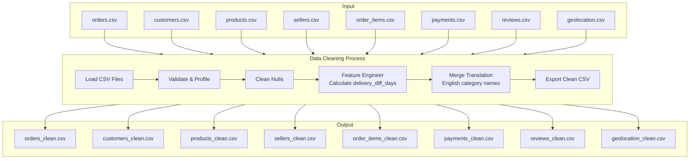

# Data Flow Diagram (DFD)

## 1. Context Level DFD (Level 0)

```mermaid
flowchart LR
    subgraph ExternalEntities["External Entities"]
        CSV["Olist CSV Files"]
        Users["Users (CEO / Managers / Sellers)"]
        BI["Power BI Dashboard"]
        Reports["Reports (CSV / PDF)"]
    end

    subgraph System["Olist Analytics System"]
        Analytics["Analytics System"]
    end

    CSV -->|"Raw Data (9 files)"| Analytics
    Analytics -->|"Cleaned Data"| BI
    Analytics -->|"Query Results"| Users
    Users -->|"Filter Criteria"| Analytics
    BI -->|"Interactive Visuals"| Users
    Users -->|"Export Request"| Reports
    Analytics -->|"Exported Data"| Reports
```

## 2. Level 1 DFD (Major Processes)

```mermaid
flowchart TD
    subgraph Input
        CSV[Olist CSV Files]
    end

    subgraph P1[P1.0 Data Cleaning & Integration]
        direction LR
        P1_1[Load Data] --> P1_2[Validate & Profile]
        P1_2 --> P1_3[Clean Nulls]
        P1_3 --> P1_4[Feature Engineer]
        P1_4 --> P1_5[Merge Tables]
        P1_5 --> P1_6[Export Clean CSV]
    end

    subgraph D6[Clean Data Store]
        CleanData[8 Clean CSV Files]
    end

    subgraph P2[P2.0 SQL Analysis]
        P2_1[Revenue Analysis] --> P2_2[Geographic Analysis]
        P2_2 --> P2_3[Reviews Analysis]
        P2_3 --> P2_4[Delivery Analysis]
    end

    subgraph P3[P3.0 Forecasting]
        P3_1[Prepare Data] --> P3_2[Train Model]
        P3_2 --> P3_3[Forecast Sales]
        P3_3 --> P3_4[Visualize Results]
    end

    subgraph P4[P4.0 Dashboard]
        P4_1[Connect Data] --> P4_2[Create Pages]
        P4_2 --> P4_3[Add DAX Measures]
        P4_3 --> P4_4[Publish Dashboard]
    end

    subgraph Output
        Users[Users]
        Reports[Reports]
    end

    CSV --> P1
    P1 --> D6
    D6 --> P2
    D6 --> P3
    D6 --> P4
    P2 --> Users
    P3 --> Users
    P4 --> Users
    Users --> Reports
```

## 3. Level 2 DFD: Data Cleaning Process (P1.0 Details)

```mermaid
flowchart TD
    subgraph Input
        orders[orders.csv]
        customers[customers.csv]
        products[products.csv]
        sellers[sellers.csv]
        items[order_items.csv]
        payments[payments.csv]
        reviews[reviews.csv]
        geolocation[geolocation.csv]
    end

    subgraph P1[Data Cleaning Process]
        P1_1[Load CSV Files] --> P1_2[Validate & Profile]
        P1_2 --> P1_3[Clean Nulls]
        P1_3 --> P1_4[Feature Engineer\nCalculate delivery_diff_days]
        P1_4 --> P1_5[Merge Translation\nEnglish category names]
        P1_5 --> P1_6[Export Clean CSV]
    end

    subgraph Output
        orders_clean[orders_clean.csv]
        customers_clean[customers_clean.csv]
        products_clean[products_clean.csv]
        sellers_clean[sellers_clean.csv]
        items_clean[order_items_clean.csv]
        payments_clean[payments_clean.csv]
        reviews_clean[reviews_clean.csv]
        geolocation_clean[geolocation_clean.csv]
    end

    orders --> P1
    customers --> P1
    products --> P1
    sellers --> P1
    items --> P1
    payments --> P1
    reviews --> P1
    geolocation --> P1

    P1 --> orders_clean
    P1 --> customers_clean
    P1 --> products_clean
    P1 --> sellers_clean
    P1 --> items_clean
    P1 --> payments_clean
    P1 --> reviews_clean
    P1 --> geolocation_clean
```
