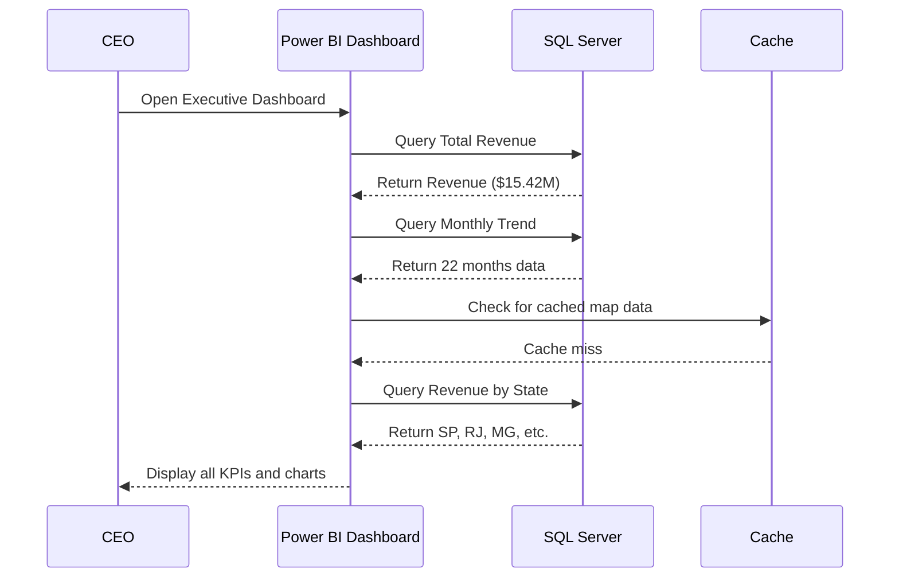
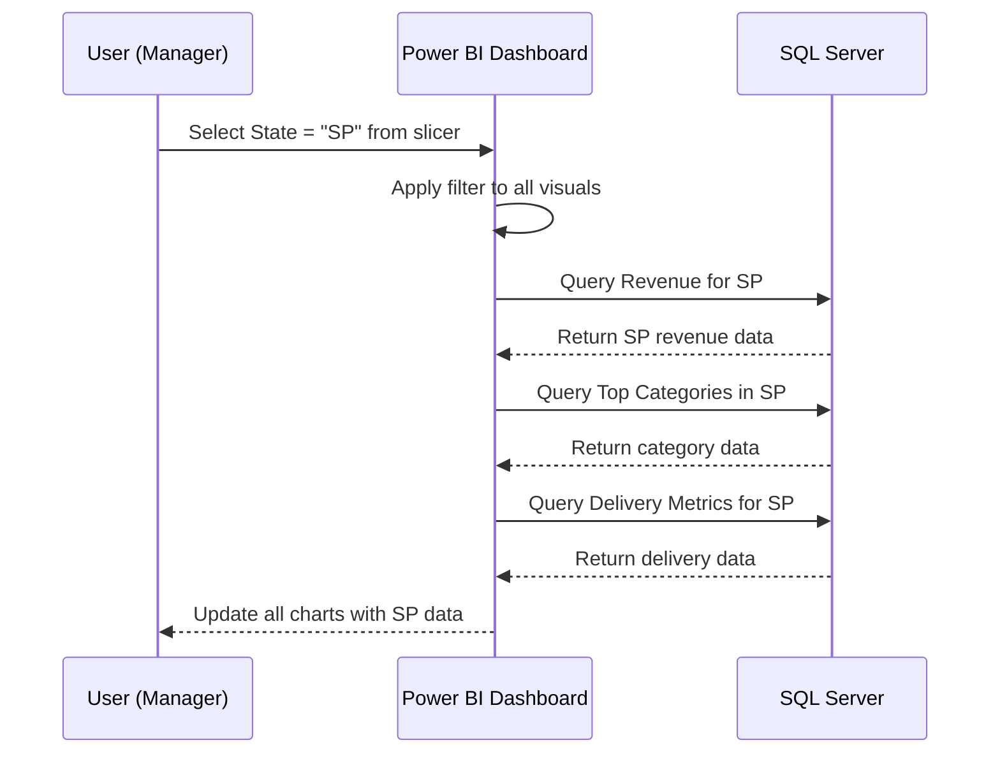
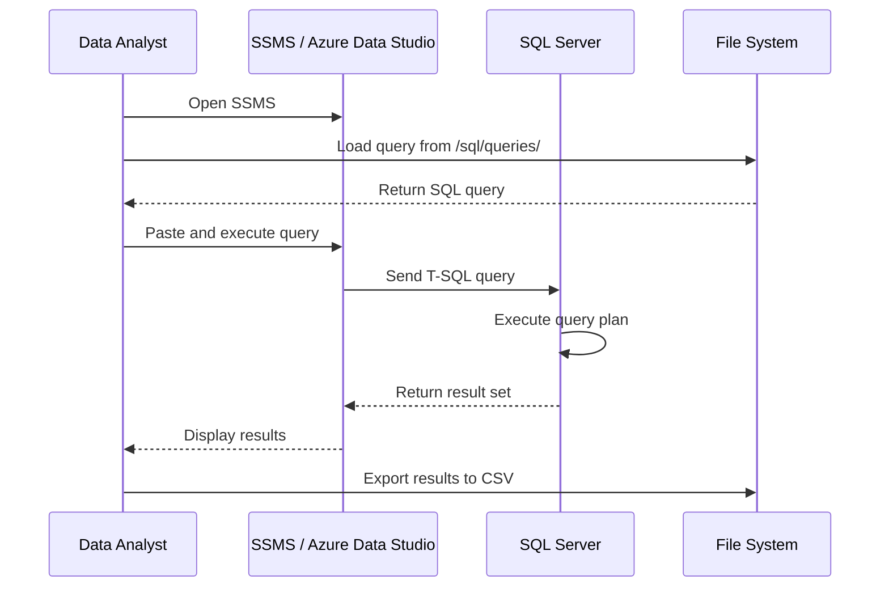
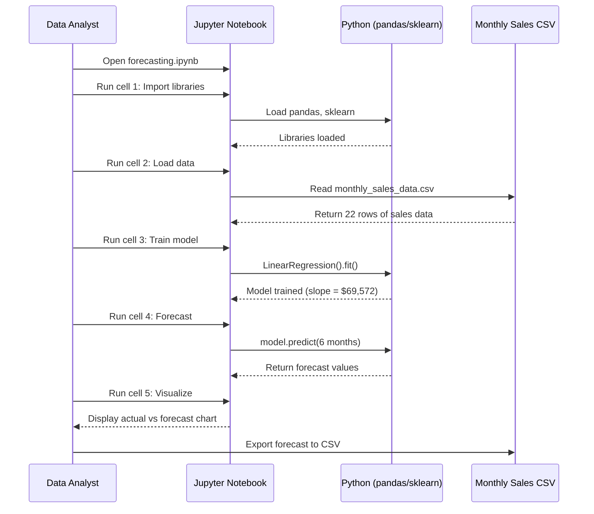
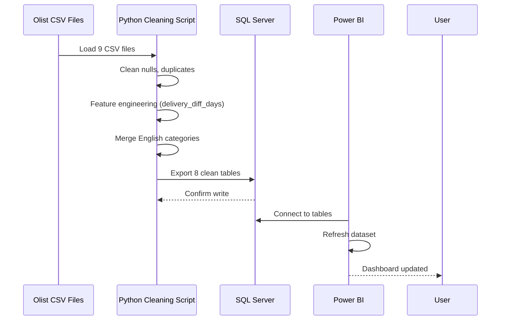

# Sequence Diagrams

## 1. UC-01: View Executive Dashboard

```mermaid
sequenceDiagram
    participant CEO
    participant Dashboard as Power BI Dashboard
    participant SQL as SQL Server
    participant Cache as Cache

    CEO->>Dashboard: Open Executive Dashboard
    Dashboard->>SQL: Query Total Revenue
    SQL-->>Dashboard: Return Revenue ($15.42M)
    Dashboard->>SQL: Query Monthly Trend
    SQL-->>Dashboard: Return 22 months data
    Dashboard->>Cache: Check for cached map data
    Cache-->>Dashboard: Cache miss
    Dashboard->>SQL: Query Revenue by State
    SQL-->>Dashboard: Return SP, RJ, MG, etc.
    Dashboard-->>CEO: Display all KPIs and charts
```

## 2. UC-02: Filter Dashboard by State

```mermaid
sequenceDiagram
    participant User as User (Manager)
    participant Dashboard as Power BI Dashboard
    participant SQL as SQL Server

    User->>Dashboard: Select State = "SP" from slicer
    Dashboard->>Dashboard: Apply filter to all visuals
    Dashboard->>SQL: Query Revenue for SP
    SQL-->>Dashboard: Return SP revenue data
    Dashboard->>SQL: Query Top Categories in SP
    SQL-->>Dashboard: Return category data
    Dashboard->>SQL: Query Delivery Metrics for SP
    SQL-->>Dashboard: Return delivery data
    Dashboard-->>User: Update all charts with SP data
```

## 3. UC-07: Run SQL Query

```mermaid
sequenceDiagram
    participant Analyst as Data Analyst
    participant SSMS as SSMS / Azure Data Studio
    participant SQL as SQL Server
    participant File as File System

    Analyst->>SSMS: Open SSMS
    Analyst->>File: Load query from /sql/queries/
    File-->>Analyst: Return SQL query
    Analyst->>SSMS: Paste and execute query
    SSMS->>SQL: Send T-SQL query
    SQL->>SQL: Execute query plan
    SQL-->>SSMS: Return result set
    SSMS-->>Analyst: Display results
    Analyst->>File: Export results to CSV
```

## 4. UC-08: Run Forecast Model

```mermaid
sequenceDiagram
    participant Analyst as Data Analyst
    participant Notebook as Jupyter Notebook
    participant Python as Python (pandas/sklearn)
    participant CSV as Monthly Sales CSV

    Analyst->>Notebook: Open forecasting.ipynb
    Analyst->>Notebook: Run cell 1: Import libraries
    Notebook->>Python: Load pandas, sklearn
    Python-->>Notebook: Libraries loaded
    Analyst->>Notebook: Run cell 2: Load data
    Notebook->>CSV: Read monthly_sales_data.csv
    CSV-->>Notebook: Return 22 rows of sales data
    Analyst->>Notebook: Run cell 3: Train model
    Notebook->>Python: LinearRegression().fit()
    Python-->>Notebook: Model trained (slope = $69,572)
    Analyst->>Notebook: Run cell 4: Forecast
    Notebook->>Python: model.predict(6 months)
    Python-->>Notebook: Return forecast values
    Analyst->>Notebook: Run cell 5: Visualize
    Notebook-->>Analyst: Display actual vs forecast chart
    Analyst->>CSV: Export forecast to CSV
```

## 5. ETL Data Pipeline

```mermaid
sequenceDiagram
    participant Source as Olist CSV Files
    participant Python as Python Cleaning Script
    participant SQL as SQL Server
    participant PowerBI as Power BI

    Source->>Python: Load 9 CSV files
    Python->>Python: Clean nulls, duplicates
    Python->>Python: Feature engineering (delivery_diff_days)
    Python->>Python: Merge English categories
    Python->>SQL: Export 8 clean tables
    SQL-->>Python: Confirm write
    PowerBI->>SQL: Connect to tables
    PowerBI->>PowerBI: Refresh dataset
    PowerBI-->>User: Dashboard updated
```
