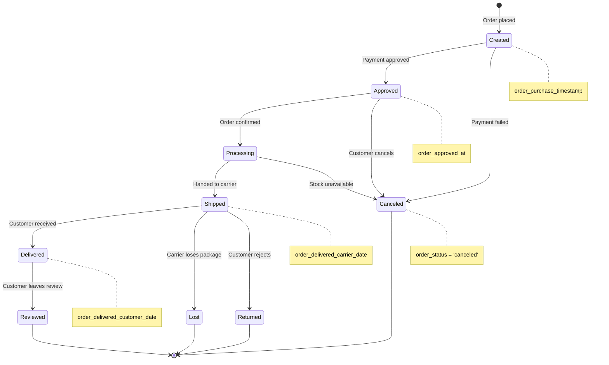
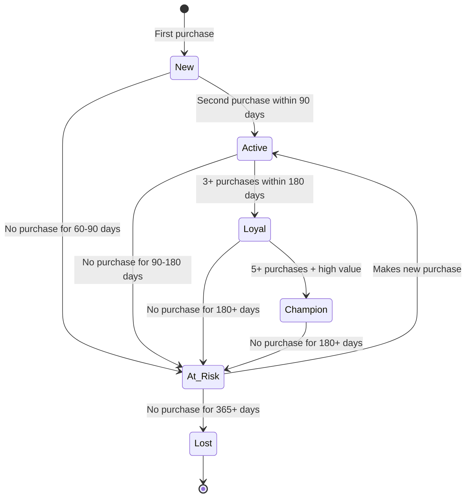
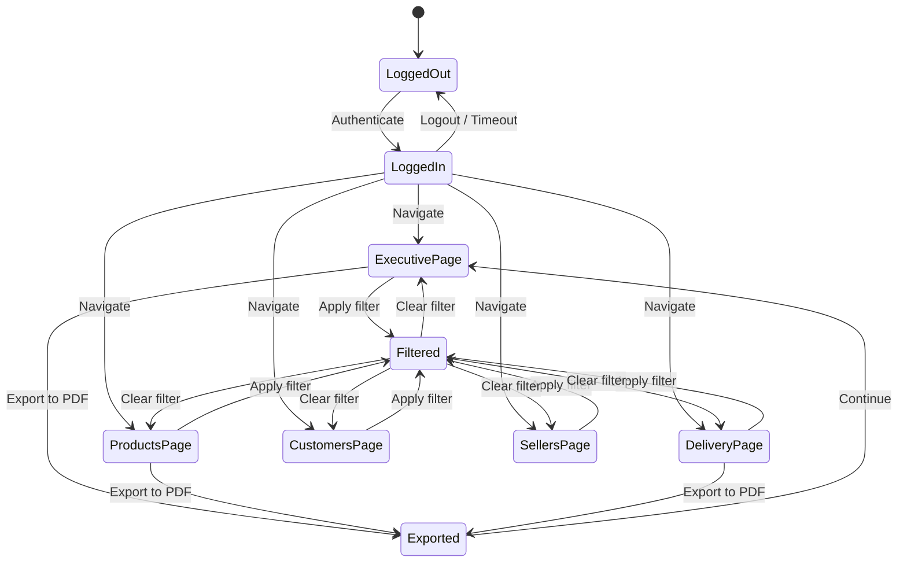

# State Diagram

## Order Lifecycle State Diagram

```mermaid
stateDiagram-v2
    [*] --> Created: Order placed
    
    Created --> Approved: Payment approved
    Created --> Canceled: Payment failed
    
    Approved --> Processing: Order confirmed
    Approved --> Canceled: Customer cancels
    
    Processing --> Shipped: Handed to carrier
    Processing --> Canceled: Stock unavailable
    
    Shipped --> Delivered: Customer received
    Shipped --> Lost: Carrier loses package
    Shipped --> Returned: Customer rejects
    
    Delivered --> Reviewed: Customer leaves review
    Reviewed --> [*]
    
    Canceled --> [*]
    Lost --> [*]
    Returned --> [*]
    
    note right of Created: order_purchase_timestamp
    note right of Approved: order_approved_at
    note right of Shipped: order_delivered_carrier_date
    note right of Delivered: order_delivered_customer_date
    note right of Canceled: order_status = 'canceled'
```

## Customer State Diagram (RFM)

```mermaid
stateDiagram-v2
    [*] --> New: First purchase
    
    New --> Active: Second purchase within 90 days
    New --> At_Risk: No purchase for 60-90 days
    
    Active --> Loyal: 3+ purchases within 180 days
    Active --> At_Risk: No purchase for 90-180 days
    
    Loyal --> Champion: 5+ purchases + high value
    Loyal --> At_Risk: No purchase for 180+ days
    
    At_Risk --> Active: Makes new purchase
    At_Risk --> Lost: No purchase for 365+ days
    
    Champion --> At_Risk: No purchase for 180+ days
    
    Lost --> [*]
```

## Dashboard Session State Diagram

```mermaid
stateDiagram-v2
    [*] --> LoggedOut
    
    LoggedOut --> LoggedIn: Authenticate
    LoggedIn --> LoggedOut: Logout / Timeout
    
    LoggedIn --> ExecutivePage: Navigate
    LoggedIn --> ProductsPage: Navigate
    LoggedIn --> DeliveryPage: Navigate
    LoggedIn --> CustomersPage: Navigate
    LoggedIn --> SellersPage: Navigate
    
    ExecutivePage --> Filtered: Apply filter
    ProductsPage --> Filtered: Apply filter
    DeliveryPage --> Filtered: Apply filter
    CustomersPage --> Filtered: Apply filter
    SellersPage --> Filtered: Apply filter
    
    Filtered --> ExecutivePage: Clear filter
    Filtered --> ProductsPage: Clear filter
    Filtered --> DeliveryPage: Clear filter
    Filtered --> CustomersPage: Clear filter
    Filtered --> SellersPage: Clear filter
    
    ExecutivePage --> Exported: Export to PDF
    ProductsPage --> Exported: Export to PDF
    DeliveryPage --> Exported: Export to PDF
    
    Exported --> ExecutivePage: Continue
```
