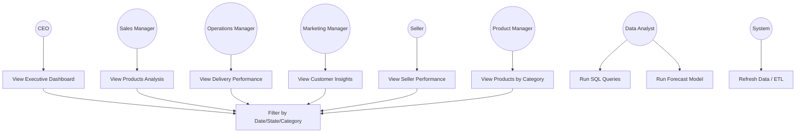

# Use Case Diagram & Descriptions

## 1. Use Case Diagram (Mermaid)

## 2. Actors Description

| Actor | Type | Description |
|-------|------|-------------|
| CEO | Primary | Executive decision maker, views high-level KPIs |
| Sales Manager | Primary | Analyzes product and category performance |
| Operations Manager | Primary | Monitors delivery performance and delays |
| Marketing Manager | Primary | Analyzes customer behavior and retention |
| Seller | Primary | Views individual performance benchmarks |
| Product Manager | Primary | Analyzes product categories and pricing |
| Data Analyst | Primary | Runs SQL queries and forecasting models |
| System | Secondary | Automated data refresh (ETL) |

## 3. Use Case Descriptions

### UC-01: View Executive Dashboard

| Element | Description |
|---------|-------------|
| **Actor** | CEO |
| **Description** | CEO views overall business performance metrics |
| **Precondition** | Dashboard is deployed and accessible |
| **Main Flow** | 1. CEO opens Power BI dashboard 2. Navigates to Executive Dashboard page 3. Views Total Revenue, Orders, AOV KPIs 4. Views revenue trend chart 5. Views revenue by state map 6. Views top categories bar chart |
| **Includes** | UC-10 (Filter by Date/State/Category) |

### UC-02: View Products Analysis

| Actor | Sales Manager |
|-------|---------------|
| **Description** | Sales manager analyzes top/bottom products and categories |
| **Includes** | UC-10 (Filter by Date/State/Category) |

### UC-03: View Delivery Performance

| Actor | Operations Manager |
|-------|--------------------|
| **Description** | Operations manager monitors delivery metrics and delays |
| **Includes** | UC-10 (Filter by Date/State/Category) |

### UC-04: View Customer Insights

| Actor | Marketing Manager |
|-------|-------------------|
| **Description** | Marketing manager analyzes customer behavior |
| **Includes** | UC-10 (Filter by Date/State/Category) |

### UC-05: View Seller Performance

| Actor | Seller |
|-------|--------|
| **Description** | Seller views individual performance metrics |

### UC-06: View Products by Category

| Actor | Product Manager |
|-------|-----------------|
| **Description** | Product manager analyzes category performance |

### UC-07: Run SQL Queries

| Actor | Data Analyst |
|-------|--------------|
| **Description** | Data analyst runs predefined or custom SQL queries |

### UC-08: Run Forecast Model

| Actor | Data Analyst |
|-------|--------------|
| **Description** | Data analyst runs sales forecasting model |

### UC-09: Refresh Data (ETL)

| Actor | System (Automated) |
|-------|--------------------|
| **Description** | System refreshes data from source |

### UC-10: Filter by Date/State/Category

| Actor | CEO, Sales Manager, Operations Manager, Marketing Manager |
|-------|-----------------------------------------------------------|
| **Description** | User applies filters to narrow down data |
